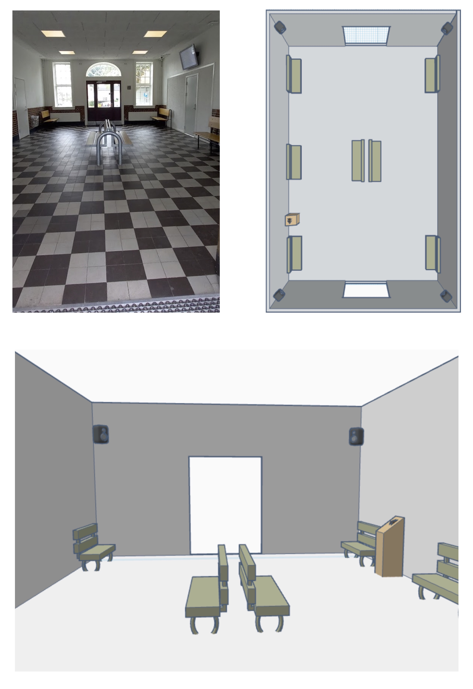

# Genhør Grindsted Station

Sound art project in the town of Grindsted, Denmark. Due to the railway, Grindsted underwent rapid development during the period 1900-1930. Industry flourished, the population increased tenfold, and the city became one of the country's largest railway junctions. Today, the railway has been discontinued, but the publicly accessible station building still stands.

From June 15th to October 31st, 2024, 'Genhør Grindsted Station' is realized, in collaboration with Billund Municipality and Mark | Museum for a New Danish History. In the station's vestibule, the audience enters a three-dimensional and living sound artwork inspired by the building's heyday. The sound of locomotives, passengers, and freight handling reoccupies the space from four wall-mounted speakers.

The playback is initialised by human detection sensors through a Bela Board.

## Visualisation

